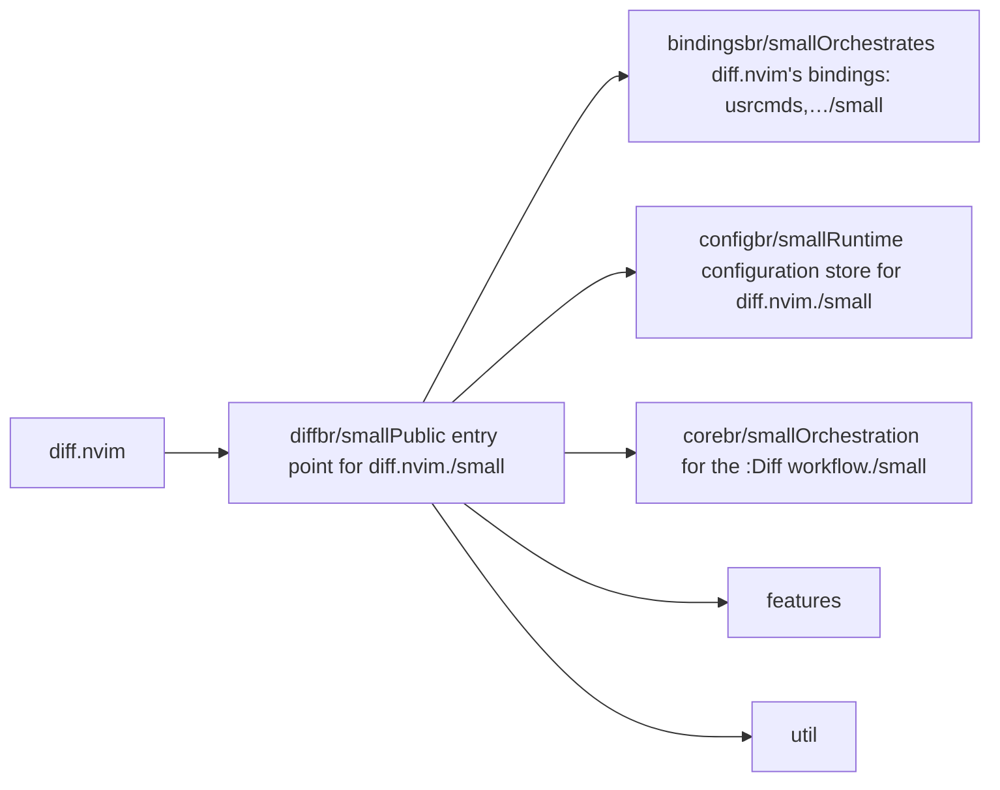
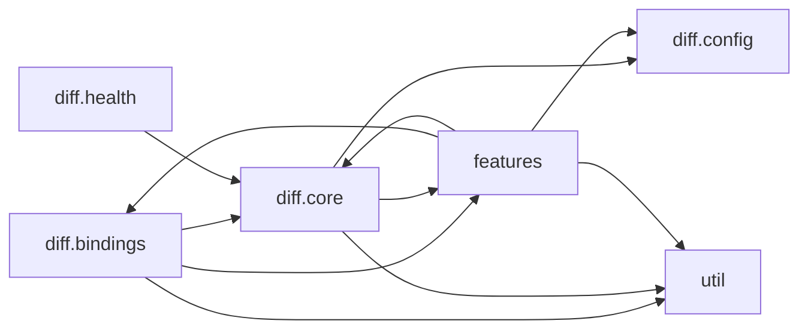

# diff.nvim — module map

> **Generated** by `documentation`. Do not edit by hand — run `:DocMap`
> (or `nvim --headless -l scripts/gen_map.lua`) to regenerate.

**4 modules** · 3 namespaces · 19 helper files

The [interactive map](index.html) has filtering, full descriptions and
source links; this page is the version the code host renders directly.

## Namespaces

## Dependencies

Which parts of the tree require which, rolled up to the second level.
The [interactive map](index.html)'s **Deps** view has this per module,
in both directions, with load-time and lazy requires told apart.

## Modules

| Module | Description | Fns | Docs |
|---|---|---|---|
| `diff` | Public entry point for diff.nvim. | 8 | [src](../../lua/diff/init.lua) |
| &nbsp;&nbsp;`diff.bindings` | Orchestrates diff.nvim's bindings: usrcmds, keymaps, autocmds. | 1 | [src](../../lua/diff/bindings/init.lua) |
| &nbsp;&nbsp;`diff.config` | Runtime configuration store for diff.nvim. | 2 | [src](../../lua/diff/config/init.lua) |
| &nbsp;&nbsp;`diff.core` | Orchestration for the :Diff workflow. | 17 | [src](../../lua/diff/core/init.lua) |
| &nbsp;&nbsp;`features` |  |  |  |
| &nbsp;&nbsp;`util` |  |  |  |

## Drift

0 errors · 15 warnings · 6 info

| Severity | Check | Message |
|---|---|---|
| warn | `dead-see-target` | execute_three_way: @see target 'docs/three-way-diff.md' does not resolve to a known module or function |
| warn | `dead-see-target` | M.three_way: @see target 'docs/three-way-diff.md' does not resolve to a known module or function |
| warn | `doc-references-missing` | docs/configuration.md:66 references 'diff.stat_list', but diff has no 'stat_list' |
| warn | `doc-references-missing` | docs/configuration.md:57 references 'diff.image_compare', but diff has no 'image_compare' |
| warn | `doc-references-missing` | docs/configuration.md:68 references 'diff.stat_list_mode', but diff has no 'stat_list_mode' |
| warn | `doc-references-missing` | docs/installation.md:9 references 'diff.image_compare', but diff has no 'image_compare' |
| warn | `doc-references-missing` | docs/configuration.md:78 references 'diff.directory_max_files', but diff has no 'directory_max_files' |
| warn | `doc-references-missing` | docs/url-sources.md:19 references 'diff.url_timeout_ms', but diff has no 'url_timeout_ms' |
| warn | `doc-references-missing` | docs/configuration.md:46 references 'diff.word_diff', but diff has no 'word_diff' |
| warn | `doc-references-missing` | docs/configuration.md:52 references 'diff.url_timeout_ms', but diff has no 'url_timeout_ms' |
| warn | `doc-references-missing` | docs/WORKFLOW.md:129 references 'diff.url_timeout_ms', but diff has no 'url_timeout_ms' |
| warn | `doc-references-missing` | docs/BINDINGS.md:27 references 'diff.image_compare', but diff has no 'image_compare' |
| warn | `doc-references-missing` | docs/WORKFLOW.md:75 references 'diff.word_diff', but diff has no 'word_diff' |
| warn | `doc-references-missing` | docs/WORKFLOW.md:88 references 'diff.default_orig_view', but diff has no 'default_orig_view' |
| warn | `doc-references-missing` | docs/configuration.md:43 references 'diff.default_orig_view', but diff has no 'default_orig_view' |

6 informational findings

| Check | Message |
|---|---|
| `missing-readme` | lua/diff has no README.md |
| `missing-readme` | lua/diff/bindings has no README.md |
| `missing-readme` | lua/diff/config has no README.md |
| `missing-readme` | lua/diff/core has no README.md |
| `unreferenced-module` | diff.@types is required by no other file in the tree |
| `unreferenced-module` | diff.health is required by no other file in the tree |

